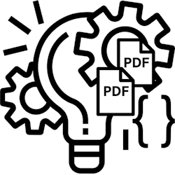
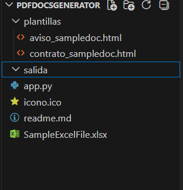
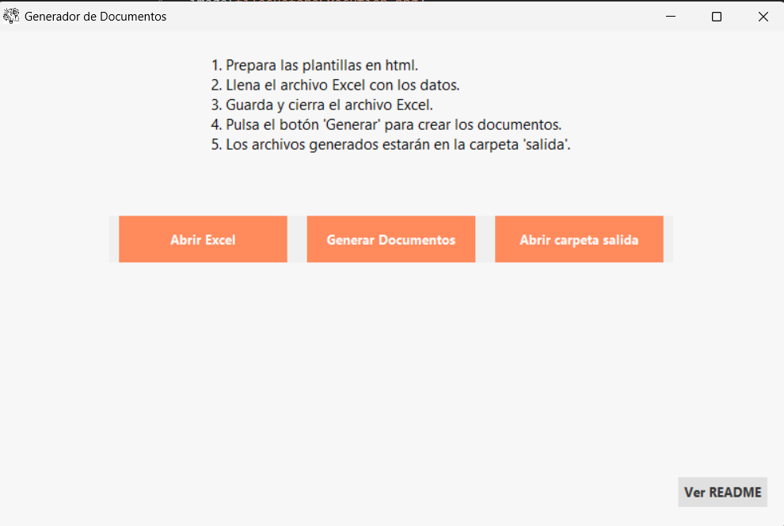
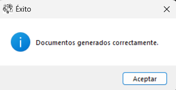
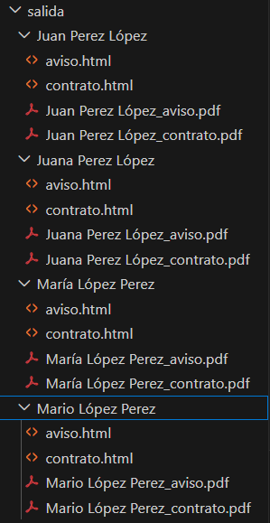
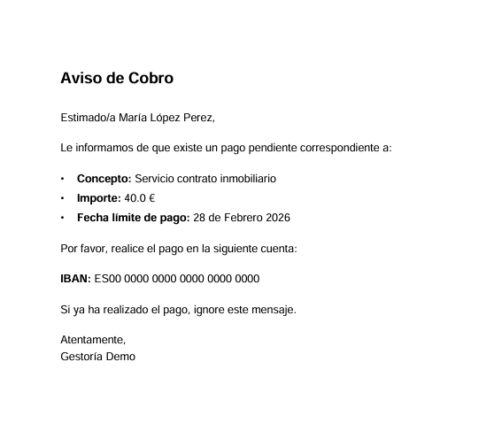

# Starter Project — Generador Automático de Documentos (HTML + PDF) con Python

Este es un **proyecto de ejemplo** que muestra cómo generar documentos (HTML y PDF) a partir de datos almacenados en un archivo Excel, utilizando **Python**, **Jinja2** y **xhtml2pdf**.

El objetivo es ofrecer una base sencilla y adaptable para automatizar documentos repetitivos: contratos, avisos, certificados, comunicaciones internas, etc.

No es una aplicación final, sino un **punto de partida** para que cada persona pueda ajustarlo a sus necesidades.

---

## 🚀 ¿Qué hace este proyecto?

A partir de un archivo Excel con datos básicos, el programa genera automáticamente:

- Un **Contrato de Arrendamiento** (HTML, útil para enviar por correo)
- Un **Aviso de Cobro** (HTML, útil para enviar por correo)
- Un **PDF final** de cada documento

Cada cliente del Excel genera su propia carpeta dentro de `/salida`.

---

## 📁 Estructura del proyecto

starter-legal-docs/
│
├── app.py
├── README.md
├── icono.ico
├── Logo.png
│
├── plantillas/
│     ├── contrato_arrendamiento.html
│     ├── aviso_cobro.html
│
├── SampleExcelFile.xlsx
│
├── salida/
│
└── images/
├── filesBeforeExecution.png
├── screen.png
├── message.png
├── after.png
└── pdf.png

### Antes de ejecutar:

---

## 🧩 ¿Cómo funciona?

1. Edita el archivo `SampleExcelFile.xlsx` con la información de cada cliente.
2. Ejecuta el programa:

 \\\ python app.py \\\

### Pantalla principal:

Cuando el proceso termina, se muestra un mensaje de confirmación:

3. El generador creará una carpeta por cliente dentro de `/salida`, por ejemplo:

/salida/Juan Perez/
contrato.html
aviso.html
Juan Perez_contrato.pdf
Juan Perez_aviso.pdf

### Archivos generados:

### Ejemplo de PDF generado:

---

## 📝 Personalización

### ✔️ Plantillas HTML  
Edita los archivos dentro de `/plantillas/`:

- `contrato_arrendamiento.html`
- `aviso_cobro.html`

Las variables entre `{{ }}` se rellenan automáticamente con los datos del Excel.

### ✔️ Columnas del Excel  
Modifica `SampleExcelFile.xlsx` según tus necesidades.  
Si cambias nombres de columnas, actualiza también el código en `app.py`.

### ✔️ Estilos y logos  
Este starter genera PDFs básicos.  
Si quieres añadir:

- logotipos  
- cabeceras  
- pies de página  
- estilos corporativos  

…puedes hacerlo directamente en las plantillas HTML.

> 💡 Nota: xhtml2pdf soporta HTML sencillo.  
> Para diseños más complejos, puedes sustituirlo por WeasyPrint o wkhtmltopdf.

---

## 📦 Requisitos

Instala las dependencias con:

\\\ pip install -r requirements.txt \\\

El archivo `requirements.txt` incluye:

pandas
jinja2
xhtml2pdf

---

## 🔧 Sugerencias de mejora para quien quiera ampliar el proyecto

Este starter project está diseñado para ser simple, pero se puede extender fácilmente.  
Aquí van algunas ideas útiles:

### ✔️ 1. Permitir elegir el archivo Excel de origen  
- Selección mediante `tkinter.filedialog`  
- Validación de columnas  
- Soporte para distintos modelos de datos  

---

### ✔️ 2. Permitir elegir qué plantilla(s) generar  
- Detectar automáticamente los `.html` dentro de `/plantillas/`  
- Mostrar una lista seleccionable  
- Generar solo los documentos marcados  

Esto evitarían generar todas las plantillas para todos los registros del Excel.

---

### ✔️ 3. Detectar automáticamente las columnas del Excel y mapearlas a variables  
- Leer dinámicamente los encabezados  
- Crear un diccionario automático para Jinja2  
- Detectar variables usadas en la plantilla  
- Avisar si falta alguna columna  

Esto convertiría el proyecto en un generador **totalmente flexible**.

---

### ✔️ 4. Añadir un modo “solo HTML” o “solo PDF”  
Útil para revisar o integrar en pipelines.

---

### ✔️ 5. Añadir logs o mensajes de validación  
- Avisar si falta una columna  
- Avisar si una plantilla contiene variables no definidas  
- Registrar errores en un archivo de log  

---

## 🎯 Objetivo del proyecto

Este repositorio sirve como ejemplo práctico para quien quiera:

- Automatizar documentos repetitivos  
- Aprender a combinar Excel + HTML + PDF  
- Crear herramientas internas rápidas  
- Entender un flujo real de generación documental  
- Adaptar el código a sus propios casos de uso  

---

## 💬 Contexto

Este starter project nace de un caso real:  
tuve que actualizar documentación legal para **más de 40 tiendas online**, y decidí automatizar el proceso aprendiendo Python sobre la marcha.

Este repositorio recoge una versión simplificada del enfoque, para que cualquiera pueda entenderlo y adaptarlo.

---

## 📄 Licencia

Este proyecto se distribuye bajo la **Licencia MIT**.

Puedes usarlo, modificarlo y adaptarlo libremente, incluso para proyectos comerciales.

Consulta el archivo LICENSE para más detalles.

## ⚖️ Disclaimer

Este proyecto es un **starter project** con fines educativos y de automatización básica.  
**No** constituye asesoramiento legal, fiscal ni financiero. Las plantillas y ejemplos incluidos son **de muestra** y deben ser revisados y adaptados por un profesional competente antes de su uso en entornos reales o con datos sensibles.

**Antes de publicar o usar** los documentos generados en producción:
- Sustituye los datos de ejemplo por información válida y verificada.  
- Revisa y adapta el contenido legal con asesoría jurídica cuando corresponda.  
- No incluyas datos personales reales en el repositorio público.  

El autor no se hace responsable del uso que se haga de este código ni de las consecuencias legales derivadas de su aplicación.

---

## © Katuxos Web Software Boutique — 2025  
Starter Project para automatización documental
